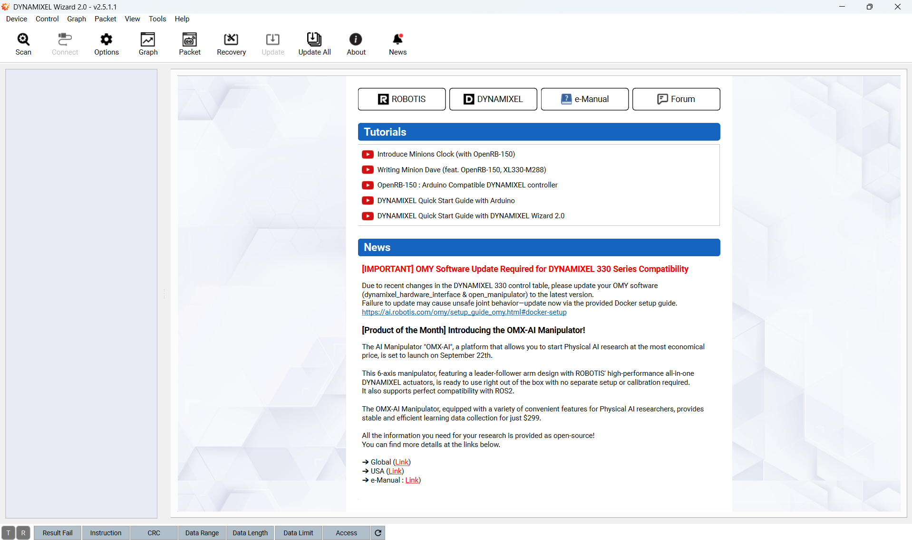
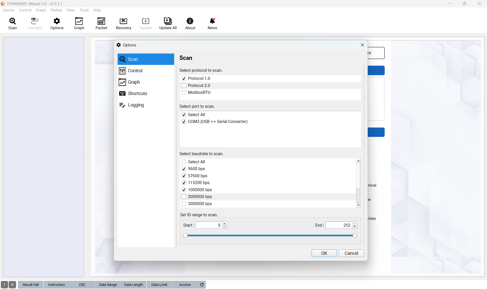
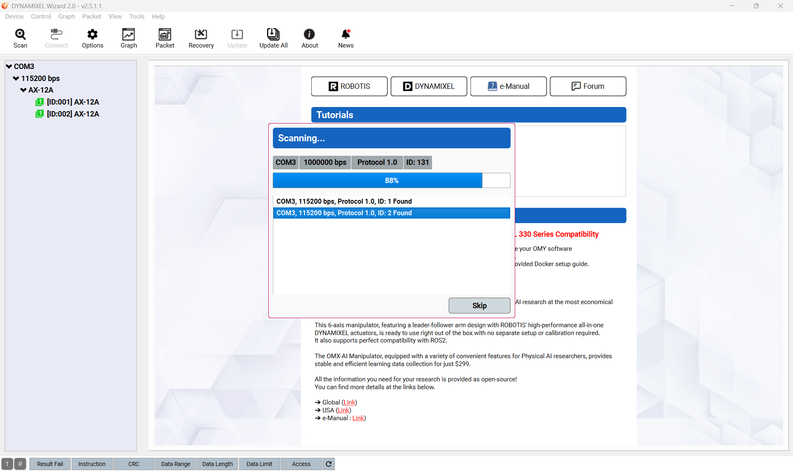
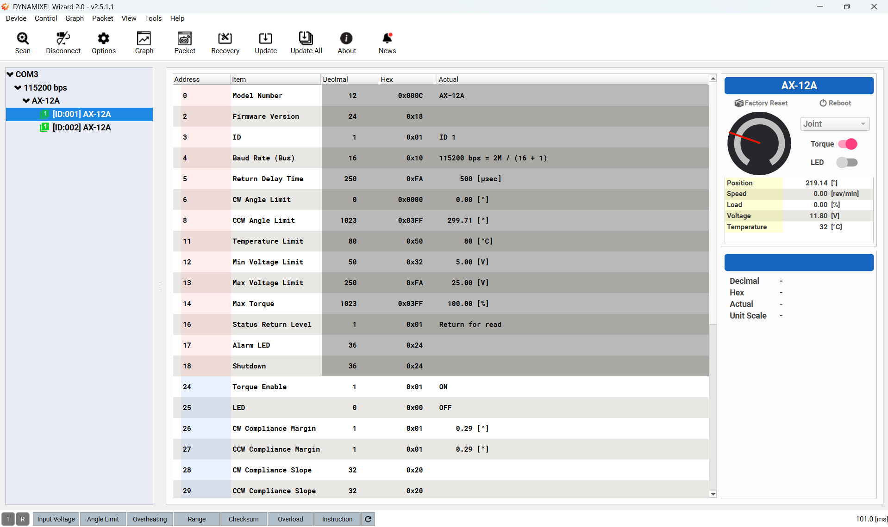

###############################
Description matérielle du robot
###############################

*************************
Aperçu global du matériel
*************************

#. `Raspberry Pi 5 <https://www.raspberrypi.com/products/raspberry-pi-5/>`_

   #. `Active Cooler <https://www.raspberrypi.com/products/active-cooler/>`_
   #. `NVMe Base <https://shop.pimoroni.com/products/nvme-base?variant=41219587178579>`_
   #. `SSD <https://www.adata.com/fr/consumer/category/ssds/solid-state-drives-legend-700/?tab=description>`_ (stockage)

#. Maquette de pantographe

   #. 2 moteurs Dynamixel `AX-12A <https://emanual.robotis.com/docs/en/dxl/ax/ax-12a/>`_
   #. Convertisseur de communication USB `U2D2 <https://emanual.robotis.com/docs/en/parts/interface/u2d2/>`_
   #. Alimentation Dynamixel 12 V

****************************************
Configuration des servomoteurs Dynamixel
****************************************

La configuration des servomoteurs Dynamixel est nécessaire pour leur utilisation, en particulier pour définir leur identifiant (ID) et leur vitesse de communication (baudrate).
Pour ce faire, nous allons utiliser le logiciel `Dynamixel Wizard <https://emanual.robotis.com/docs/en/software/dynamixel/dynamixel_wizard2/>`_.
Téléchargez et installez le logiciel (disponible pour Windows, macOS et Linux, y compris ARM64). L'installation sous Windows est à privilégier.

Une fois le logiciel installé, connectez le convertisseur U2D2 à votre ordinateur via USB, puis reliez les servomoteurs Dynamixel au convertisseur en utilisant le câble du moteur sur le connecteur marqué TTL. Nous recommandons également de connecter l'alimentation 12 V des moteurs pour garantir leur bon fonctionnement.

Lancez le logiciel Dynamixel Wizard, vous devriez voir l'écran d'accueil suivant :

Cliquez sur "Scan" pour ouvrir les paramètres de scan, vous devriez voir l'écran suivant :
Les servomoteurs Dynamixel AX-12A ont un débit (baudrate) maximal de 1 Mb/s et ne sont compatibles qu'avec le protocole 1.0. C'est pourquoi nous vous recommandons d'utiliser les paramètres ci-dessous :

Après avoir cliqué sur "Start Scan", le logiciel va rechercher les moteurs connectés et afficher les résultats dans l'écran suivant:

Une fois le scan terminé, identifiez les moteurs. Ceux-ci ne disposant pas de LED, vous devrez les mettre en rotation individuellement pour les différencier.
Sélectionnez un moteur dans la liste, choisissez le mode de votre choix ("joint" ou "wheel"), activez le moteur en cliquant sur "Torque" et faites-le tourner en choisissant une consigne.

Après avoir identifié les moteurs, vous pouvez modifier leur ID et leur baudrate en cliquant sur "Set". Nous vous recommandons d'utiliser les paramètres suivants :
#. Baudrate : 115200 bps
#. ID du moteur q1 : 1
#. ID du moteur q4 : 2

Ces paramètres sont utilisés dans la suite du projet, en particulier pour l'interface matérielle (hardware interface) ROS 2 et les tests du driver.
